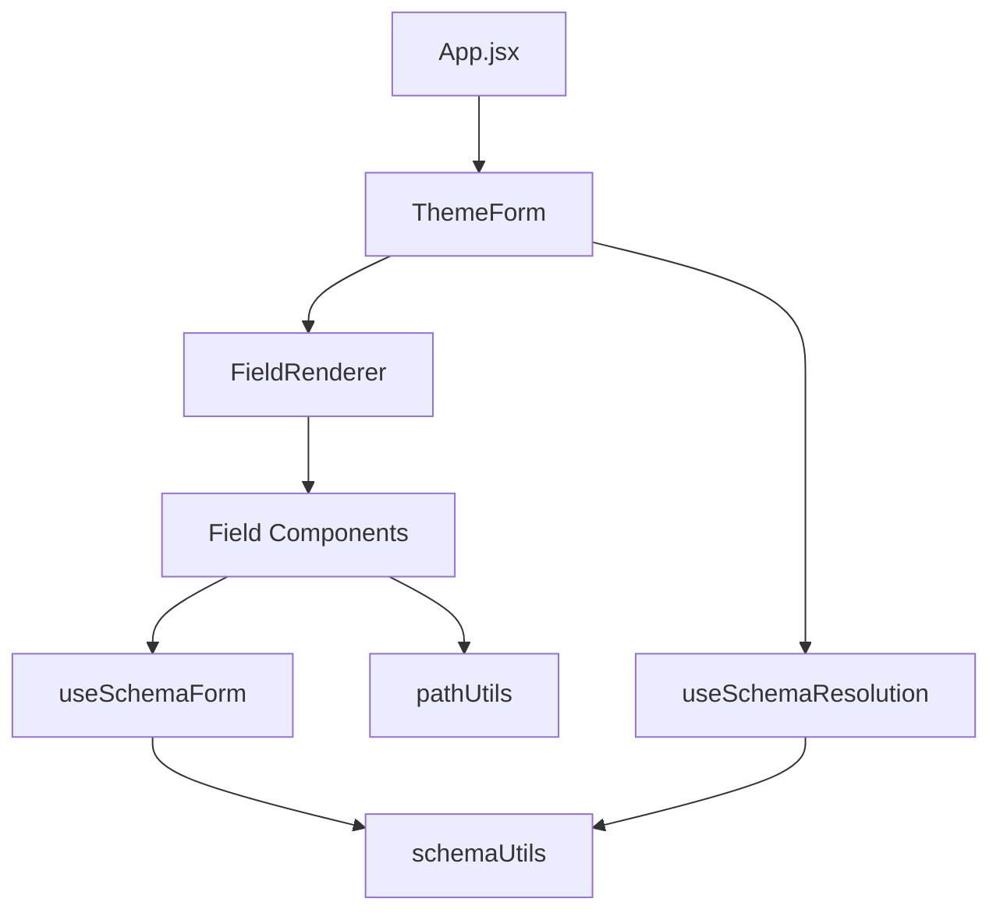
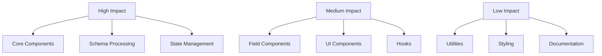

# Power BI Theme Editor - Technical Architecture & Guidelines

## Table of Contents
1. [Theme System](#theme-system)
2. [Project Structure](#project-structure)
3. [Component Architecture](#component-architecture)
4. [Form Implementation](#form-implementation)
5. [Schema Processing](#schema-processing)
6. [UI Guidelines](#ui-guidelines)
7. [Performance Guidelines](#performance-guidelines)
8. [Function Dependencies](#function-dependencies)
9. [Development Guidelines](#development-guidelines)
10. [Build Tools](#build-tools)
11. [UI Component Architecture](#ui-component-architecture)

## Theme System

### Light/Dark Mode Implementation
The application uses a structured theme system in tailwind.config.js with light and dark variants:

```javascript
theme: {
  colors: {
    theme: {
      light: {
        bg: {              // Background colors
          base: '#ffffff',   // Root background
          surface: '#f9f9f9', // Card/Section background
          input: '#f3f4f6',  // Input fields
          hover: '#f3f4f6'   // Hover states
        },
        text: {             // Typography colors
          primary: '#213547',
          secondary: '#666666',
          muted: '#8a8a8a',
          input: '#213547',
          placeholder: '#a1a1aa'
        },
        border: {...},      // Border colors
        accent: {...}       // Action colors
      },
      dark: {
        bg: {
          base: '#252423',    // Root background
          surface: '#323130',  // Card/Section background
          input: '#484644',    // Input fields
          hover: '#605E5C'     // Hover states
        },
        text: {...},
        border: {...},
        accent: {
          primary: '#2B88D8',  // PowerBI blue
          hover: '#4AA4EF'
        },
        state: {
          error: '#FF4444',    // High contrast states
          warning: '#FFC107',
          success: '#4CAF50'
        }
      }
    }
  }
}
```

### Color Usage Guidelines
1. **Backgrounds**
   - Use bg-theme-light-bg-base/dark-bg-base for root level
   - Use bg-theme-light-bg-surface/dark-bg-surface for cards
   - Use bg-theme-light-bg-input/dark-bg-input for form inputs

2. **Text**
   - Use text-theme-light-text-primary/dark-text-primary for main text
   - Use text-theme-light-text-secondary/dark-text-secondary for descriptions
   - Use text-theme-light-text-muted/dark-text-muted for less emphasis

3. **Actions**
   - Use accent-primary for main actions (PowerBI blue)
   - Use state colors for feedback (error, warning, success)

4. **Borders**
   - Use border-theme-light-border-default/dark-border-default for separators
   - Add hover:border-theme-light-border-hover/dark-border-hover for interaction

### Accessibility Guidelines
- Maintain WCAG AA contrast ratios in both modes
- Test all interactive elements in both modes
- Ensure proper focus states for keyboard navigation
- Provide clear visual feedback for all interactions

## Project Structure

```
powerbi-theme-editor/
├── src/
│   ├── components/           # React components
│   │   ├── core/            # Core application components
│   │   │   ├── FieldDescription.jsx   # Field description rendering
│   │   │   ├── FieldRenderer.jsx      # Dynamic field type rendering
│   │   │   ├── JsonViewer.jsx         # JSON preview display
│   │   │   ├── ThemeForm.jsx          # Main form component
│   │   │   ├── ThemeForm.test.jsx     # Form tests
│   │   │   ├── TreeLayout.jsx         # Hierarchical layout
│   │   │   └── errorBoundary.jsx      # Error handling
│   │   ├── fields/          # Form field components
│   │   │   ├── ArrayField.jsx         # Array handling
│   │   │   ├── BooleanField.jsx       # Boolean input
│   │   │   ├── ColorField.jsx         # Color picker
│   │   │   ├── EnumField.jsx          # Enumeration select
│   │   │   ├── NumberField.jsx        # Numeric input
│   │   │   ├── ObjectField.jsx        # Object structure
│   │   │   ├── StringField.jsx        # Text input
│   │   │   ├── iconField.jsx          # Icon selection
│   │   │   └── index.js               # Field exports
│   │   ├── layouts/         # Layout components
│   │   │   ├── CollapsibleSection.jsx # Collapsible sections
│   │   │   └── VerticalNavigation.jsx # Vertical nav layout
│   │   ├── renderers/       # Custom renderers
│   │   ├── common/          # Shared components
│   │   │   ├── FormField.jsx          # Base field component
│   │   │   ├── LabelWithTooltip.jsx   # Label with tooltip
│   │   │   └── Tooltip.jsx            # Tooltip component
│   │   ├── ThemeEditor.jsx            # Main editor component
│   │   └── search/          # Search components
│   ├── hooks/               # Custom React hooks
│   ├── utils/               # Utility functions
│   ├── App.jsx             # Main application
│   └── main.jsx            # Entry point
└── [other configuration files]
```

## Component Architecture

### Core Components Hierarchy
```
ThemeEditor
├── ThemeForm
│   ├── FieldRenderer
│   │   ├── FormField
│   │   │   └── Field Components
│   │   └── LabelWithTooltip
│   └── CollapsibleSection
└── JsonViewer
```

### Common Components

#### FormField
```javascript
FormField: React.Component {
  props: {
    label: string,           // Field label
    description?: string,    // Optional description for tooltip
    tooltip?: string,        // Optional tooltip content
    required?: boolean,      // Shows required indicator
    className?: string,      // Optional styling classes
    children: ReactNode      // Field content
  }
}
```

#### LabelWithTooltip
```javascript
LabelWithTooltip: React.Component {
  props: {
    label: string,           // Section/field label
    description?: string,    // Optional description
    className?: string,      // Optional styling classes
    showChevron?: boolean   // Toggle for collapsible sections
  }
}
```

#### Tooltip
```javascript
Tooltip: React.Component {
  props: {
    content: string,        // Tooltip content
    children: ReactNode,    // Trigger element
    position?: 'top' | 'right' | 'bottom' | 'left',
    maxWidth?: number      // Content wrapping
  }
}
```

### Field Components

#### ColorField
```javascript
ColorField: React.Component {
  props: {
    schema: Object,      // Color field schema
    path: String,        // Field path
    value: String,       // Current color
    onChange: Function,  // Change handler
    required: Boolean    // If field is required
  }
  state: {
    inputValue: String,  // Current input value
    error: String       // Validation error
  }
}
```

#### ObjectField
```javascript
ObjectField: React.Component {
  props: {
    schema: Object,      // Object schema
    path: String,        // Field path
    value: Object,       // Current value
    onChange: Function   // Change handler
  }
  methods: {
    processSchema(): Object,
    renderProperties(): ReactNode[]
  }
}
```

#### IconField
```javascript
IconField: React.Component {
  props: {
    schema: Object,      // Icon field schema
    path: String,        // Field path
    value: Object,       // Current value
    onChange: Function   // Change handler
  }
  methods: {
    validateSvgUrl(url: string): boolean,
    handleIconChange(name: string, value: string): void
  }
}
```

## Form Implementation

### Form State Management
```javascript
// Form state hook
useFormState: Hook {
  returns: {
    formData: Object,      // Current form data
    errors: Object,        // Validation errors
    isDirty: boolean,      // Form modified state
    resetForm: Function,   // Reset handler
    validateForm: Function // Validation trigger
  }
}
```

### Validation Implementation
```javascript
// Field validation flow
validateField(value, schema, options) {
  const mode = options.mode || 'onChange';
  
  if (mode === 'onChange') {
    return debouncedValidate(value, schema);
  }
  
  return validate(value, schema);
}
```

### Schema Fetching
```javascript
// Schema fetching hook
useFetchSchema: Hook {
  returns: {
    schema: Object | null,    // Processed schema
    isLoading: boolean,       // Loading state
    error: Error | null,      // Fetch error
    refetch: Function        // Manual refetch trigger
  }
  
  implementation: {
    caching: 'localStorage',
    retries: 3,
    timeout: 5000,
    preprocessingSteps: [
      'resolveRefs',
      'mergeAllOf',
      'processTypes'
    ]
  }
}
```

### Field Type Detection
```javascript
// Field type detection chain
determineFieldType(schema) {
  if (isColorField(schema)) return 'color';
  if (isIconField(schema)) return 'icon';
  if (isArrayField(schema)) return 'array';
  return schema.type || 'string';
}
```

## Schema Processing

### Reference Resolution System
The schema processing system handles complex references and type resolution.

#### Resolution Stages
1. **Load and Cache**
   ```javascript
   async function loadSchema() {
     const cached = await cacheManager.get('schema');
     if (cached) return cached;
     
     const schema = await fetchSchema();
     await cacheManager.set('schema', schema);
     return schema;
   }
   ```

2. **Reference Resolution**
   ```javascript
   function resolveReferences(schema, definitions) {
     const cache = new WeakMap();
     
     return function resolve(node) {
       if (cache.has(node)) return cache.get(node);
       
       const resolved = resolveNode(node, definitions);
       cache.set(node, resolved);
       return resolved;
     }
   }
   ```

3. **Type Resolution**
   ```javascript
   function resolveTypes(schema) {
     if (schema.allOf) {
       return mergeAllOf(schema.allOf);
     }
     
     if (schema.anyOf) {
       return resolveAnyOf(schema.anyOf);
     }
     
     return schema;
   }
   ```

### Pattern Property Handling
```javascript
// Pattern property detection
const patterns = {
  wildcard: /^\*/,
  numeric: /^\d+$/,
  dynamic: /^\.+$/
};

function processPatternProperties(schema) {
  if (!schema.patternProperties) return schema;
  
  return {
    ...schema,
    properties: resolvePatterns(schema.patternProperties)
  };
}
```

## UI Guidelines

### Layout Structure
The application uses a hierarchical layout system with collapsible sections.

#### Collapsible Sections
```javascript
CollapsibleSection: React.Component {
  props: {
    label: string,          // Section label
    description?: string,   // Optional description
    defaultExpanded?: boolean, // Initial state
    level?: number,         // Nesting level (1-3)
    children: ReactNode     // Section content
  }
}
```

#### Section Guidelines
1. Maximum nesting: 3 levels
2. Consistent indentation
3. Clear visual hierarchy
4. Keyboard navigation support
5. State persistence

### Visual Hierarchy
```
Level 1: Main Categories
└── Level 2: Sub-categories
    └── Level 3: Field Groups
        └── Individual Fields
```

### Form Layout
```javascript
// Basic field layout
<FormField>
  <label>
    <span>{label}</span>
    {required && <span className="text-red-500">*</span>}
  </label>
  <div className="field-wrapper">
    {children}
  </div>
  {error && (
    <span className="error-message">{error}</span>
  )}
</FormField>
```

## Performance Guidelines

### Form Optimization

#### Validation Modes
```javascript
{
  mode: 'onChange' | 'onBlur' | 'onSubmit',
  reValidateMode: 'onChange' | 'onBlur',
  shouldUnregister: boolean,
  delayError: number
}
```

#### Performance Rules
1. Use appropriate validation mode
2. Implement debounced validation
3. Cache validation results
4. Optimize re-renders
5. Lazy load components

### State Management
```javascript
// Optimized state updates
function updateFormState(path, value) {
  setFormData(prev => {
    if (isEqual(get(prev, path), value)) {
      return prev;
    }
    return set({...prev}, path, value);
  });
}
```

### Render Optimization
```javascript
// Component optimization
const MemoizedField = React.memo(({value, onChange}) => {
  const handleChange = useCallback((newValue) => {
    onChange(newValue);
  }, [onChange]);

  return <Field value={value} onChange={handleChange} />;
});
```

## Function Dependencies

### Core Function Chain


### Utility Dependencies
```javascript
// Path utilities
const pathUtils = {
  getPathSegments,
  joinPath,
  getValueAtPath,
  setValueAtPath
};

// Schema utilities
const schemaUtils = {
  resolveRefs,
  processSchema,
  validateSchema
};
```

## Development Guidelines

### Code Organization
1. Group related functionality
2. Use consistent naming
3. Maintain clear dependencies
4. Document complex logic
5. Write comprehensive tests

### Testing Requirements
1. Unit tests for utilities
2. Component integration tests
3. Form validation tests
4. Schema processing tests
5. Performance benchmarks

### Documentation Standards
1. Clear component APIs
2. Usage examples
3. Dependency documentation
4. Performance considerations
5. Accessibility notes

## Change Management Guidelines

### Change Impact Analysis

#### Component Change Impact Levels


#### Impact Assessment Checklist
1. **Schema Dependencies**
   ```javascript
   // Check for schema structure dependencies
   const dependencies = {
     schemaRefs: checkSchemaRefs(component),
     typeValidation: checkTypeValidation(component),
     pathHandling: checkPathHandling(component)
   };
   ```

2. **Component Dependencies**
   - Parent components that might rerender
   - Child components that depend on props
   - Shared state dependencies
   - Event handler chains

3. **Data Flow Impact**
   - Form state updates
   - Validation chain
   - Event propagation
   - Cache invalidation

#### Testing Requirements by Impact Level
```javascript
const testingRequirements = {
  high: {
    unit: ['core logic', 'edge cases'],
    integration: ['component chain', 'state flow'],
    e2e: ['critical paths']
  },
  medium: {
    unit: ['component logic'],
    integration: ['parent interaction'],
    visual: ['regression']
  },
  low: {
    unit: ['basic functionality'],
    visual: ['component specific']
  }
};
```

### File Modification Checklist

#### Before Modifying Core Files
1. **Dependency Analysis**
   ```javascript
   // Example dependency check
   const coreDependencies = {
     directDependents: findDirectDependents(file),
     stateDependencies: findStateDependencies(file),
     schemaDependencies: findSchemaDependencies(file)
   };
   ```

2. **State Impact**
   - [ ] Check form state dependencies
   - [ ] Review validation state impact
   - [ ] Analyze cache implications
   - [ ] Review error state handling

3. **Schema Compatibility**
   - [ ] Verify schema version compatibility
   - [ ] Check reference resolution impact
   - [ ] Test type validation changes
   - [ ] Validate path handling

4. **Performance Verification**
   - [ ] Measure render impact
   - [ ] Check memory usage
   - [ ] Verify network calls
   - [ ] Test large dataset handling

#### Before Modifying Field Components
1. **Field-Specific Checks**
   ```javascript
   const fieldChecklist = {
     validation: checkValidationRules(field),
     rendering: checkRenderingLogic(field),
     stateHandling: checkStateManagement(field),
     accessibility: checkA11y(field)
   };
   ```

2. **Implementation Requirements**
   - [ ] Verify schema pattern matching
   - [ ] Check path construction
   - [ ] Test value propagation
   - [ ] Validate error handling

3. **UI Considerations**
   - [ ] Check responsive behavior
   - [ ] Verify keyboard navigation
   - [ ] Test focus management
   - [ ] Validate ARIA attributes

### Special Field Type Considerations

#### Icon Fields
1. **Schema Pattern**
   ```javascript
   const iconFieldSchema = {
     anyOf: [{
       type: "object",
       patternProperties: {
         ".*": {
           $ref: "#/definitions/themeIcon"
         }
       }
     }]
   };
   ```

2. **Implementation Requirements**
   - Must handle SVG validation
   - Support both URL and inline SVG
   - Maintain aspect ratio handling
   - Implement proper caching

3. **Change Considerations**
   - Check icon resolution chain
   - Verify preview generation
   - Test URL validation
   - Validate size constraints

#### Color Fields
1. **Schema Pattern**
   ```javascript
   const colorFieldSchema = {
     type: "string",
     pattern: "^#([A-Fa-f0-9]{6}|[A-Fa-f0-9]{8})$",
     colorFormat: ["hex", "rgba"]
   };
   ```

2. **Validation Chain**
   - Format validation
   - Alpha channel handling
   - Intermediate state management
   - Error state handling

3. **Change Considerations**
   - Check color picker integration
   - Verify format conversion
   - Test validation feedback
   - Check performance impact

#### Transparency Fields
1. **Schema Pattern**
   ```javascript
   const transparencyFieldSchema = {
     type: "number",
     minimum: 0,
     maximum: 100,
     default: 100
   };
   ```

2. **Implementation Requirements**
   - Slider integration
   - Numeric input sync
   - Step validation
   - Range constraints

3. **Change Considerations**
   - Check value synchronization
   - Verify input methods
   - Test boundary conditions
   - Validate user feedback

### Regression Prevention Guidelines

#### Path Analysis
```javascript
// Path impact analysis
function analyzePathImpact(change) {
  return {
    affectedPaths: findAffectedPaths(change),
    validationImpact: checkValidationPaths(change),
    renderingImpact: checkRenderingPaths(change)
  };
}
```

#### State Flow Analysis
```javascript
// State flow verification
function verifyStateFlow(change) {
  return {
    stateUpdates: trackStateUpdates(change),
    sideEffects: findSideEffects(change),
    optimizations: suggestOptimizations(change)
  };
}
```

#### Change Verification Process
1. **Local Testing**
   - Unit tests for changed code
   - Integration tests for component chain
   - Visual regression tests
   - Performance benchmarks

2. **Cross-Component Testing**
   - Parent component behavior
   - Child component updates
   - Event propagation
   - State synchronization

3. **Schema Compatibility**
   - Version compatibility
   - Reference resolution
   - Type validation
   - Path handling

4. **Performance Impact**
   - Render timing
   - Memory usage
   - Network calls
   - Large dataset handling

5. **Documentation Updates**
   - Component documentation
   - Schema documentation
   - Change logs
   - Migration guides

## Build Tools

### Vite Schema Preprocessor
The application uses a custom Vite plugin for schema preprocessing during build time.

```javascript
// vite-plugin-schema-preprocessor.js
export default function schemaPreprocessor() {
  return {
    name: 'schema-preprocessor',
    // Handles schema processing during build
    transform(code, id) {
      if (id.includes('schema.json')) {
        return processSchema(code);
      }
    }
  }
}
```

#### Features
1. Pre-processes JSON schema during build
2. Resolves schema references
3. Optimizes schema structure
4. Reduces runtime processing
5. Improves initial load performance

#### Configuration
```javascript
// vite.config.js
import schemaPreprocessor from './vite-plugin-schema-preprocessor';

export default {
  plugins: [
    schemaPreprocessor({
      // Configuration options
      cacheOutput: true,
      minify: true,
      resolveRefs: true
    })
  ]
}
```

## UI Component Architecture

The application follows a layered UI component architecture with shared base components.

### Directory Structure
```
src/
└── components/
    └── ui/              # Base UI components
        ├── label.jsx    # Label component
        └── tooltip.jsx  # Tooltip component
```

### Base Components

#### Label Component
```javascript
Label: React.Component {
  props: {
    text: string,            // Label text
    htmlFor?: string,        // Input association
    required?: boolean,      // Required indicator
    className?: string      // Custom styling
  }
}

Usage:
<Label 
  text="Field Label" 
  required={true}
  htmlFor="field-id"
/>
```

#### Tooltip Component
```javascript
Tooltip: React.Component {
  props: {
    content: string | ReactNode,  // Tooltip content
    position?: Position,          // Tooltip position
    delay?: number,              // Show/hide delay
    children: ReactNode          // Trigger element
  }
}

Usage:
<Tooltip content="Helper text">
  <button>Hover me</button>
</Tooltip>
```

### Component Guidelines

1. **Base Component Usage**
   - Use base components for consistent styling
   - Extend base components rather than create new ones
   - Maintain accessibility features
   - Follow established patterns

2. **Styling Approach**
   ```javascript
   // Preferred - Use composition
   function CustomLabel({ className, ...props }) {
     return (
       <Label 
         className={clsx("custom-styles", className)}
         {...props}
       />
     );
   }
   ```

3. **Accessibility Features**
   - All base components include necessary ARIA attributes
   - Support keyboard navigation
   - Maintain focus management
   - Provide screen reader context