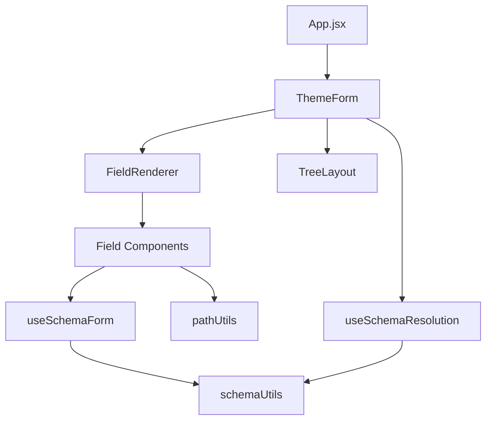

# Power BI Theme Editor - Technical Architecture & Guidelines

## Color Theme Structure

### Light/Dark Mode Implementation
The application uses a structured theme system in tailwind.config.js with light and dark variants:

```javascript
theme: {
  colors: {
    theme: {
      light: {
        bg: {              // Background colors
          base: '#ffffff',   // Root background
          surface: '#f9f9f9', // Card/Section background
          input: '#f3f4f6',  // Input fields
          hover: '#f3f4f6'   // Hover states
        },
        text: {             // Typography colors
          primary: '#213547',
          secondary: '#666666',
          muted: '#8a8a8a',
          input: '#213547',
          placeholder: '#a1a1aa'
        },
        border: {...},      // Border colors
        accent: {...}       // Action colors
      },
      dark: {
        bg: {
          base: '#252423',    // Root background
          surface: '#323130',  // Card/Section background
          input: '#484644',    // Input fields
          hover: '#605E5C'     // Hover states
        },
        text: {...},
        border: {...},
        accent: {
          primary: '#2B88D8',  // PowerBI blue
          hover: '#4AA4EF'
        },
        state: {
          error: '#FF4444',    // High contrast states
          warning: '#FFC107',
          success: '#4CAF50'
        }
      }
    }
  }
}
```

### Color Usage Guidelines
1. **Backgrounds**
   - Use bg-theme-light-bg-base/dark-bg-base for root level
   - Use bg-theme-light-bg-surface/dark-bg-surface for cards
   - Use bg-theme-light-bg-input/dark-bg-input for form inputs

2. **Text**
   - Use text-theme-light-text-primary/dark-text-primary for main text
   - Use text-theme-light-text-secondary/dark-text-secondary for descriptions
   - Use text-theme-light-text-muted/dark-text-muted for less emphasis

3. **Actions**
   - Use accent-primary for main actions (PowerBI blue)
   - Use state colors for feedback (error, warning, success)

4. **Borders**
   - Use border-theme-light-border-default/dark-border-default for separators
   - Add hover:border-theme-light-border-hover/dark-border-hover for interaction

### Accessibility Guidelines
- Maintain WCAG AA contrast ratios in both modes
- Test all interactive elements in both modes
- Ensure proper focus states for keyboard navigation
- Provide clear visual feedback for all interactions


## Project File Structure
```
powerbi-theme-editor/
├── src/
│   ├── components/           # React components
│   │   ├── core/            # Core application components
│   │   │   ├── FieldDescription.jsx   # Field description rendering
│   │   │   ├── FieldRenderer.jsx      # Dynamic field type rendering
│   │   │   ├── JsonViewer.jsx         # JSON preview display
│   │   │   ├── ThemeForm.jsx          # Main form component
│   │   │   ├── ThemeForm.test.jsx     # Form tests
│   │   │   ├── TreeLayout.jsx         # Hierarchical layout
│   │   │   └── errorBoundary.jsx      # Error handling
│   │   ├── fields/          # Form field components
│   │   │   ├── ArrayField.jsx         # Array handling
│   │   │   ├── BooleanField.jsx       # Boolean input
│   │   │   ├── ColorField.jsx         # Color picker
│   │   │   ├── EnumField.jsx          # Enumeration select
│   │   │   ├── NumberField.jsx        # Numeric input
│   │   │   ├── ObjectField.jsx        # Object structure
│   │   │   ├── StringField.jsx        # Text input
│   │   │   ├── iconField.jsx          # Icon selection
│   │   │   └── index.js               # Field exports
│   │   ├── layouts/         # Layout components
│   │   │   └── VerticalNavigation.jsx # Vertical nav layout
│   │   ├── renderers/       # Custom renderers
│   │   │   ├── ArrayObjectRenderer.jsx    # Array rendering
│   │   │   ├── ColorPickerRenderer.jsx    # Color picker
│   │   │   └── ObjectRenderer.jsx         # Object rendering
│   │   ├── FormField.jsx              # Base field component
│   │   ├── ThemeEditor.jsx            # Main editor component
│   │   ├── schemaVersions.js          # Version management
│   │   ├── searchBar.jsx              # Search functionality
│   │   ├── searchBar.test.jsx         # Search tests
│   │   └── searchResults.jsx          # Search results display
│   ├── hooks/               # Custom React hooks
│   │   ├── useFormState.js            # Form state management
│   │   ├── useSchemaForm.js           # Schema form handling
│   │   ├── useSchemaResolution.js     # Schema resolution
│   │   ├── useSchemaResolution.test.js # Resolution tests
│   │   └── useThemeSearch.js          # Search functionality
│   ├── utils/               # Utility functions
│   │   ├── pathUtils.js               # Path handling
│   │   ├── schemaLoader.js            # Schema loading
│   │   ├── schemaUtils.js             # Schema processing
│   │   ├── schemaUtils.test.js        # Schema tests
│   │   └── search.js                  # Search utilities
│   ├── App.jsx             # Main application
│   └── main.jsx            # Entry point
└── [other configuration files]
```

## Function Map
### Core Components Functions

#### ThemeForm.jsx
```javascript
exports {
  ThemeForm: React.Component {
    props: {
      schema: Object,        // Form schema
      onChange: Function,    // Value change handler
      ref: {                 // Imperative handle
        expandPath: Function // Expands form to show path
      }
    }
    state: {
      formData: Object,     // Current form data
      errors: Object        // Validation errors
    }
    methods: {
      handleChange(path, value),
      validateForm(),
      expandPath(segments)
    }
  }
}
```

#### FieldRenderer.jsx
```javascript
exports {
  FieldRenderer: React.Component {
    props: {
      schema: Object,      // Field schema
      path: String,        // Field path
      value: any,          // Current value
      onChange: Function   // Change handler
    }
    methods: {
      determineFieldType(schema): string,
      renderField(): ReactNode
    }
  },
  determineFieldType: Function(schema) => string
}
```

### Field Components Functions

#### ColorField.jsx
```javascript
exports {
  ColorField: React.Component {
    props: {
      schema: Object,    // Color field schema
      path: String,      // Field path
      value: String,     // Current color
      onChange: Function // Change handler
    }
    state: {
      inputValue: String,
      error: String
    }
    methods: {
      validateColor(color): boolean,
      handleInputChange(event),
      handlePickerChange(color)
    }
  }
}
```

#### ObjectField.jsx
```javascript
exports {
  ObjectField: React.Component {
    props: {
      schema: Object,    // Object schema
      path: String,      // Field path
      value: Object,     // Current object
      onChange: Function // Change handler
    }
    methods: {
      processComplexSchema(schema): Object,
      renderProperties(): ReactNode[]
    }
  }
}
```

#### iconField.jsx
```javascript
exports {
  IconField: React.Component {
    props: {
      schema: Object,    // Field schema with icon configuration
      path: String,      // Field path
      value: Object,     // Current icons object
      onChange: Function // Change handler
    }
    state: {
      newIconName: String,  // For new icon creation
    }
    methods: {
      handleAddIcon(): void,
      handleRemoveIcon(iconName: string): void,
      handleIconChange(iconName: string, field: string, value: string): void,
      validateSvgUrl(url: string): boolean
    }
  }
}

### Hook Functions

#### useSchemaForm.js
```javascript
exports {
  useSchemaForm: Function(schema, initialValue) => {
    formData: Object,      // Current form data
    errors: Object,        // Validation errors
    isValid: boolean,      // Form validity
    handleChange: Function,// Change handler
    validateForm: Function,// Validation trigger
    resetForm: Function    // Form reset
  }
}
```

#### useSchemaResolution.js
```javascript
exports {
  useSchemaResolution: Function(schema) => {
    resolvedSchema: Object,// Resolved schema
    isLoading: boolean,    // Loading state
    error: Error          // Resolution error
  },
  resolveSchemaRef: Function(schema, rootSchema) => Object
}
```
### Color Groups Implementation
The application uses a structured color grouping system defined in `utils/colorGroups.js`:

#### Color Grouping Rules
1. **Path-Based Grouping**
   - Only top-level color properties are grouped
   - Properties in nested paths are rendered normally
   - Path checks prevent grouping of similar-named nested properties

2. **Group Detection Chain**
   ```javascript
   // Color group detection chain
   isColorField(fieldName, path)  // Checks if field should be grouped
   -> getColorGroup(fieldName, path)  // Gets appropriate group
   -> getColorGroups(schema, path)  // Builds group structure
   UI Structure

3. **UI Structure**
- Base Colors section appears after Text Classes
- Each color group uses collapsible sections
- Groups are collapsed by default
- Maintains existing schema structure while providing organized UI

4. **Modification Guidelines**
- Add new color fields to appropriate groups in colorGroups.js
- Maintain group order in groupOrder array
- Ensure path checks for new color implementations
- Test impact on nested properties

### Utility Functions

#### pathUtils.js
```javascript
exports {
  getPathSegments: Function(path: string) => string[],
  setValueAtPath: Function(obj: Object, path: string, value: any) => Object,
  getValueAtPath: Function(obj: Object, path: string) => any,
  joinPath: Function(...segments: string[]) => string
}
```

#### schemaUtils.js
```javascript
exports {
  resolveInternalRefs: Function(schema, definitions) => Object,
  createDefaultValue: Function(schema) => any,
  validateField: Function(schema, value) => {
    valid: boolean,
    errors: string[]
  },
  getFieldType: Function(schema) => string,
  processComplexSchema: Function(schema) => Object
}
```
#### Color Group Utilities
```javascript
exports {
  // Color group detection and processing
  isColorField: Function(fieldName: string, path: string) => boolean,
  getColorGroup: Function(fieldName: string, path: string) => string | null,
  isColorGroupParent: Function(schema: Object, path: string) => boolean,
  getColorGroups: Function(schema: Object, path: string) => Object | null
}
```


## Function Dependencies


## Function Usage Guidelines

### 1. Path Management Chain
```javascript
// Correct usage order
const path = pathUtils.getPathSegments(rawPath);
const value = pathUtils.getValueAtPath(formData, path);
const newValue = fieldComponent.handleChange(value);
pathUtils.setValueAtPath(formData, path, newValue);
```

### 2. Schema Processing Chain
```javascript
// Correct processing order
const schemaLoader.loadSchema()
  .then(schema => useSchemaResolution(schema))
  .then(resolvedSchema => processComplexSchema(resolvedSchema))
  .then(processedSchema => {
    // Use in components
  });
```


### 3. Component Update Flow
```javascript
// Proper component update sequence
ThemeForm.handleChange(path, value)
  -> FieldRenderer.renderField()
  -> SpecificField.handleChange()
  -> useSchemaForm.handleChange()
  -> pathUtils.setValueAtPath()
```

### 4. Error Propagation Chain
```javascript
// Error handling flow
SpecificField.validate()
  -> useSchemaForm.validateField()
  -> schemaUtils.validateField()
  -> ThemeForm.handleError()
  -> ErrorBoundary.catch()
```

### 5. Icon Field Detection Chain
```javascript
// Schema structure for icon fields
{
  anyOf: [
    {
      type: "object",
      patternProperties: {
        ".*" or ".+": Object // Either pattern triggers icon field
      }
    },
    // Alternative array format
    {
      type: "array",
      items: Object
    }
  ]
}

// Detection flow
FieldRenderer.determineFieldType(schema)
  -> Check schema.anyOf
  -> Validate patternProperties
  -> Return 'icon' type if matched
  -> Render IconField component
```

## File Dependencies

### Critical Dependencies
1. **Schema Processing**
   ```
   schemaLoader.js → schemaUtils.js → useSchemaResolution.js
   ```

2. **Form Generation**
   ```
   ThemeForm.jsx → FieldRenderer.jsx → Field Components
   ```

3. **State Management**
   ```
   useFormState.js → useSchemaForm.js → Component State
   ```

4. **Icon Management**
```
iconField.jsx → index.js (registration) → FieldRenderer.jsx (detection)
```

### Change Impact Analysis
Before modifying any file, check its dependencies:

1. **High Impact Files**
   - schemaUtils.js
   - pathUtils.js
   - FieldRenderer.jsx
   - ThemeForm.jsx

2. **Medium Impact Files**
   - Field Components
   - useSchemaForm.js
   - useSchemaResolution.js

3. **Localized Impact Files**
   - Layout Components
   - Search Components
   - Individual Field Types

## File Modification Checklist

### Before Modifying Core Files
1. Check dependent files
2. Review function usage across project
3. Verify test coverage
4. Plan migration strategy
5. Update documentation

### Before Modifying Field Components
1. Check parent component dependencies
2. Verify schema compliance
3. Test validation rules
4. Update field-specific tests
5. Document changes

### Before Modifying Utilities
1. Check all import locations
2. Verify function signatures
3. Test edge cases
4. Update utility tests
5. Document API changes

### Special Field Type Considerations
1. **Icon Fields**
   - Must respect schema pattern with `anyOf` structure
   - Support both `.*` and `.+` pattern properties
   - Require proper field registration in `fields/index.js`
   - Include SVG validation and preview capabilities